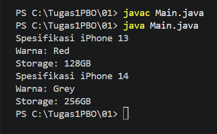
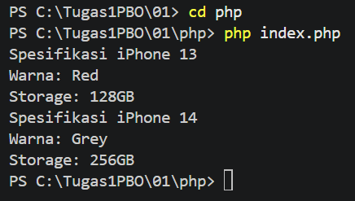

# **Tugas 01 - Class dan Object**

## Biodata

| **Keterangan** | **Isi** |
|---|---|
| Nama | **Mochammad Jihan Isfalana** |
| NIM | **4525210110** |
| Kelas | **A** |
| Mata Kuliah | Pemrograman Berorientasi Objek |
| Dosen Pengampu | **Adi Wahyu Pribadi, S.Si., M.Kom** |

## Deskripsi Tugas

Program ini merupakan contoh penerapan konsep dasar pemrograman berorientasi objek menggunakan class `iPhone`.
Program membuat dua object iPhone dengan spesifikasi yang berbeda, kemudian menampilkan warna dan kapasitas penyimpanannya.

Program dibuat dalam dua versi:

- Java: `iPhone.java` dan `Main.java`
- PHP: `php/iPhone.php` dan `php/index.php`

## Konsep yang Digunakan

### Class

Class `iPhone` digunakan sebagai cetak biru object. Class ini memiliki dua property:

- `color`, untuk menyimpan warna iPhone.
- `storage`, untuk menyimpan kapasitas penyimpanan iPhone.

### Constructor

Constructor menerima parameter `color` dan `storage`, lalu menyimpannya ke property object. Pada Java, constructor bernama `iPhone`, sedangkan pada PHP menggunakan method `__construct`.

### Object

Pada file `Main.java` dan `php/index.php`, dibuat dua object:

```text
iphone13 = Red, 128GB
iphone14 = Grey, 256GB
```

### Method

Class `iPhone` memiliki dua method untuk mengambil nilai property:

- `getColor()` mengembalikan warna iPhone.
- `getStorage()` mengembalikan kapasitas penyimpanan iPhone.

## Screenshot Hasil Run

### Hasil Run Java



### Hasil Run PHP

