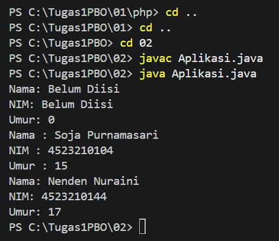
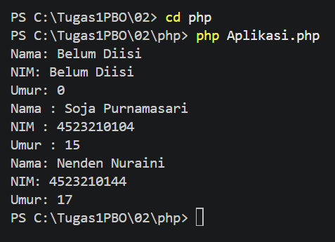

# **Tugas 02 - Encapsulation dan Constructor**

## Biodata

| **Keterangan** | **Isi** |
|---|---|
| Nama | **Mochammad Jihan Isfalana** |
| NIM | **4525210110** |
| Kelas | **A** |
| Mata Kuliah | Pemrograman Berorientasi Objek |
| Dosen Pengampu | **Adi Wahyu Pribadi, S.Si., M.Kom** |

## Deskripsi Tugas

Program ini menerapkan konsep encapsulation pada class `Mahasiswa`. Data mahasiswa berupa nama, NIM, dan umur disimpan sebagai property `private`, sehingga akses dan perubahan data dilakukan melalui getter dan setter.

Program tersedia dalam dua versi:

- Java: `Mahasiswa.java` dan `Aplikasi.java`
- PHP: `php/Mahasiswa.php` dan `php/Aplikasi.php`

## Konsep yang Digunakan

### Class

Class `Mahasiswa` digunakan sebagai cetak biru object. Class ini memiliki tiga property private:

- `nama`, untuk menyimpan nama mahasiswa.
- `nim`, untuk menyimpan nomor induk mahasiswa.
- `umur`, untuk menyimpan umur mahasiswa.

Penggunaan property `private` menerapkan konsep encapsulation karena data tidak dapat diakses langsung dari luar class.

### Constructor

Pada Java terdapat tiga constructor:

1. Constructor tanpa parameter memberikan nilai awal `Belum Diisi` dan `0`.
2. Constructor dengan parameter `nama` dan `nim` memberikan nilai default umur `0`.
3. Constructor dengan parameter `nama`, `nim`, dan `umur` mengisi seluruh data.

PHP tidak mendukung constructor overloading secara langsung. Oleh karena itu, `Mahasiswa.php` menggunakan satu `__construct` dengan parameter opsional agar dapat digunakan dengan perilaku yang sama.

### Object

Pada file `Aplikasi.java` dan `php/Aplikasi.php`, dibuat dua object:

```text
soja = Belum Diisi, Belum Diisi, 0
nenden = Nenden Nuraini, 4523210144, 17
```

Object `soja` kemudian diubah menggunakan setter untuk mengisi nama, NIM, dan umur.

### Method

Class `Mahasiswa` memiliki method getter dan setter untuk mengakses property secara terkontrol:

- `getNama()` dan `setNama()`
- `getNim()` dan `setNim()`
- `getUmur()` dan `setUmur()`
- `tampilkanInfo()` untuk menampilkan data mahasiswa.

## Screenshot Hasil Run

### Hasil Run Java



### Hasil Run PHP



