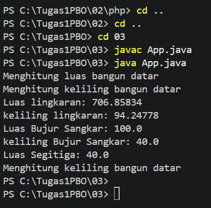
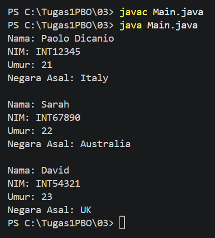
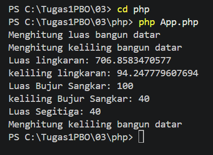
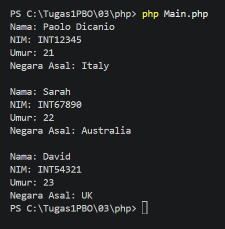

# **Tugas 03 - Inheritance dan Method Overriding**

## Biodata

| **Keterangan** | **Isi** |
|---|---|
| Nama | **Mochammad Jihan Isfalana** |
| NIM | **4525210110** |
| Kelas | **A** |
| Mata Kuliah | Pemrograman Berorientasi Objek |
| Dosen Pengampu | **Adi Wahyu Pribadi, S.Si., M.Kom** |

## Deskripsi Tugas

Program ini merupakan contoh penerapan inheritance dan method overriding dalam pemrograman berorientasi objek.
Program memiliki dua contoh pewarisan, yaitu class bangun datar dan class mahasiswa internasional.

Program dibuat dalam dua versi:

- Java: `BangunDatar.java`, class turunannya, `Mahasiswa.java`, `MahasiswaInternational.java`, `App.java`, dan `Main.java`
- PHP: class yang sama pada folder `php/`

## Konsep yang Digunakan

### Class

Class `BangunDatar` menjadi parent class untuk `Lingkaran`, `Persegi`, dan `Segitiga`.
Class `Mahasiswa` menjadi parent class untuk `MahasiswaInternational`.

### Constructor

Setiap class turunan memiliki constructor untuk mengisi property masing-masing. `MahasiswaInternational` meneruskan data mahasiswa ke constructor parent `Mahasiswa`, kemudian menambahkan property `negaraAsal`.

### Object

Pada file `App.java` dan `php/App.php`, dibuat object berikut:

```text
BangunDatar
Lingkaran dengan jari-jari 15
Persegi dengan sisi 10
Segitiga dengan alas 10 dan tinggi 8
```

Pada file `Main.java` dan `php/Main.php`, dibuat tiga object `MahasiswaInternational` dengan data mahasiswa internasional yang berbeda.

### Method

Class `BangunDatar` memiliki method `luas()` dan `keliling()` yang dioverride oleh class turunannya.
`Lingkaran`, `Persegi`, dan `Segitiga` menghitung luas sesuai bentuk masing-masing.
Class `Segitiga` tidak mengoverride `keliling()`, sehingga menggunakan method dari parent class.

Class `MahasiswaInternational` mengoverride method `tampilkanInfo()` dari `Mahasiswa` untuk menambahkan informasi negara asal.

## Screenshot Hasil Run

### Hasil Run Java


---


### Hasil Run PHP


---

