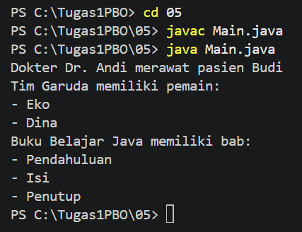
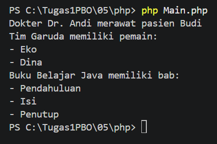

# **Tugas 05 - Asosiasi, Agregasi, dan Komposisi**

## Biodata

| **Keterangan** | **Isi** |
|---|---|
| Nama | **Mochammad Jihan Isfalana** |
| NIM | **4525210110** |
| Kelas | **A** |
| Mata Kuliah | Pemrograman Berorientasi Objek |
| Dosen Pengampu | **Adi Wahyu Pribadi, S.Si., M.Kom** |

## Deskripsi Tugas

Program ini merupakan contoh penerapan hubungan antar-class dalam pemrograman berorientasi objek, yaitu asosiasi, agregasi, dan komposisi.

Program dibuat dalam dua versi:

- Java: `Bab.java`, `Buku.java`, `Dokter.java`, `Pasien.java`, `Pemain.java`, `Tim.java`, dan `Main.java`
- PHP: class yang sama pada folder `php/`

## Konsep yang Digunakan

### Class

Program menggunakan beberapa class untuk menggambarkan hubungan antar-object:

- `Dokter` dan `Pasien` untuk asosiasi.
- `Tim` dan `Pemain` untuk agregasi.
- `Buku` dan `Bab` untuk komposisi.

### Constructor

Setiap class memiliki constructor untuk mengisi property object. `Buku` membuat daftar `Bab` secara internal melalui method `tambahBab()`.

### Object

Pada file `Main.java` dan `php/Main.php`, dibuat object berikut:

```text
Dokter: Dr. Andi
Pasien: Budi
Tim: Garuda dengan pemain Eko dan Dina
Buku: Belajar Java dengan bab Pendahuluan, Isi, dan Penutup
```

### Method

Class `Dokter` memiliki method `merawat()` untuk berinteraksi dengan `Pasien`.
Class `Tim` memiliki method `tampilkanPemain()` untuk menampilkan daftar pemain.
Class `Buku` memiliki method `tampilkanBab()` untuk menampilkan daftar bab.

## Jenis Relasi

### Asosiasi

Object `Dokter` berinteraksi dengan object `Pasien` melalui method `merawat()`. Kedua object dibuat secara terpisah.

### Agregasi

Object `Tim` menerima daftar object `Pemain` yang sudah dibuat dari luar. Pemain tetap dapat berdiri sendiri meskipun object `Tim` tidak digunakan.

### Komposisi

Object `Buku` membuat object `Bab` di dalam class-nya sendiri. Bab merupakan bagian dari buku dan dibuat ketika object `Buku` dibuat.

## Screenshot Hasil Run

### Hasil Run Java



### Hasil Run PHP



