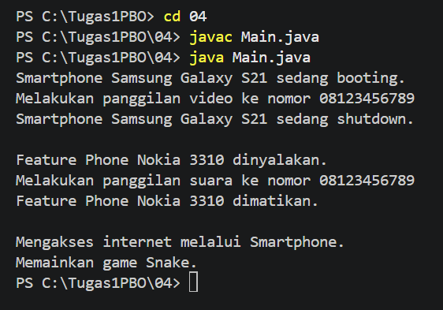
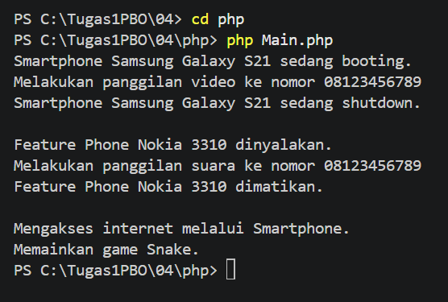
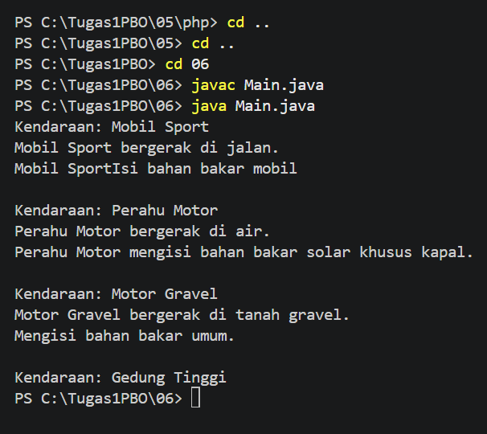
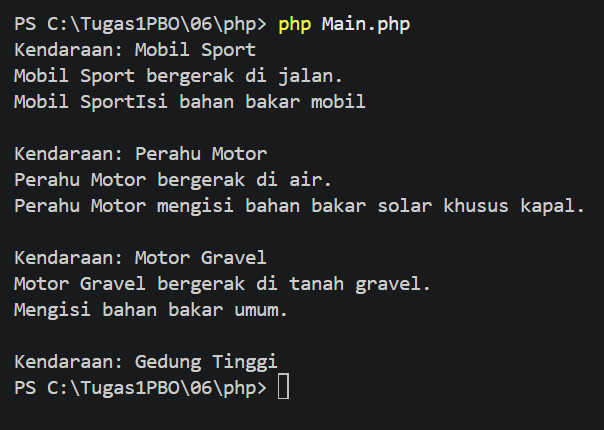

# PEMROGRAMAN BERORIENTASI OBJEK

## Biodata

| **Keterangan** | **Isi** |
|---|---|
| Nama | **Mochammad Jihan Isfalana** |
| NIM | **4525210110** |
| Program Studi | **Teknik Informatika** |
| Kelas | **A** |
| Mata Kuliah | Pemrograman Berorientasi Objek |
| Dosen Pengampu | **Adi Wahyu Pribadi, S.Si., M.Kom** |
| Semester | **3 (Ganjil)** |

## Teknologi yang Digunakan

Tugas dibuat menggunakan dua bahasa pemrograman berikut:

- **Java** dengan Java Development Kit (JDK).
- **PHP** dengan PHP interpreter.

Visual Studio Code digunakan sebagai IDE dengan extension Java Red Hat,
PHP Intelephense, Prettier, dan Error Lens.

## Materi Pembelajaran

Repository ini berisi penerapan konsep pemrograman berorientasi objek pada
tugas 01 sampai tugas 06:

1. Class dan Object
2. Encapsulation dan Constructor
3. Inheritance dan Method Overriding
4. Polimorfisme
5. Asosiasi, Agregasi, dan Komposisi
6. Abstract Class dan Interface

Setiap tugas dibuat dalam versi Java dan PHP. Penjelasan implementasi yang
lebih rinci tersedia pada README di masing-masing folder tugas.

---

## Tugas 01 - Class dan Object

### Deskripsi Tugas

Program ini menggunakan class `iPhone` sebagai cetak biru object. Dua object
iPhone dibuat dengan warna dan kapasitas penyimpanan yang berbeda, kemudian
informasinya ditampilkan melalui method `getColor()` dan `getStorage()`.

### Konsep yang Digunakan

- **Class:** `iPhone` memiliki property `color` dan `storage`.
- **Constructor:** mengisi warna dan kapasitas penyimpanan object.
- **Object:** membuat object iPhone 13 dan iPhone 14.
- **Method:** mengambil dan menampilkan data object.

### Screenshot Hasil Run

#### Hasil Run Java

#### Hasil Run PHP

---

## Tugas 02 - Encapsulation dan Constructor

### Deskripsi Tugas

Program ini menerapkan encapsulation pada class `Mahasiswa`. Property
`nama`, `nim`, dan `umur` dibuat `private`, sehingga akses dan perubahan data
dilakukan melalui getter dan setter.

### Konsep yang Digunakan

- **Encapsulation:** data mahasiswa tidak dapat diakses langsung dari luar
  class.
- **Constructor:** menyediakan beberapa cara untuk membuat object mahasiswa.
- **Getter dan setter:** mengakses serta mengubah data secara terkontrol.
- **Method:** `tampilkanInfo()` menampilkan data mahasiswa.

### Screenshot Hasil Run

#### Hasil Run Java

#### Hasil Run PHP

---

## Tugas 03 - Inheritance dan Method Overriding

### Deskripsi Tugas

Program ini menerapkan inheritance dan method overriding melalui dua contoh.
Class `BangunDatar` diwarisi oleh `Lingkaran`, `Persegi`, dan `Segitiga`.
Selain itu, class `MahasiswaInternational` mewarisi class `Mahasiswa`.

### Konsep yang Digunakan

- **Inheritance:** class turunan mewarisi property dan method dari parent class.
- **Constructor:** class turunan meneruskan data ke constructor parent.
- **Method overriding:** class turunan mengubah perilaku method `luas()` atau
  `tampilkanInfo()` sesuai kebutuhan.
- **Object:** membuat object bangun datar dan mahasiswa internasional.

### Screenshot Hasil Run

#### Hasil Run Java

#### Hasil Run PHP

---

## Tugas 04 - Inheritance dan Polimorfisme

### Deskripsi Tugas

Program ini menerapkan inheritance dan polimorfisme pada class `Handphone`.
Class `Smartphone` dan `FeaturePhone` mewarisi `Handphone`, kemudian
mengubah perilaku method `nyalakan()`, `matikan()`, dan `telepon()`.

### Konsep yang Digunakan

- **Inheritance:** `Smartphone` dan `FeaturePhone` merupakan child class dari
  `Handphone`.
- **Polimorfisme:** method yang sama menghasilkan perilaku berbeda berdasarkan
  jenis object.
- **Method overriding:** setiap child class mengimplementasikan perilakunya
  sendiri.
- **Method khusus:** `aksesInternet()` hanya dimiliki smartphone, sedangkan
  `mainGameSnake()` hanya dimiliki feature phone.

### Screenshot Hasil Run

#### Hasil Run Java

#### Hasil Run PHP

---

## Tugas 05 - Asosiasi, Agregasi, dan Komposisi

### Deskripsi Tugas

Program ini menerapkan hubungan antar-object menggunakan tiga jenis relasi,
yaitu asosiasi, agregasi, dan komposisi.

### Konsep yang Digunakan

- **Asosiasi:** `Dokter` berinteraksi dengan `Pasien`; kedua object dibuat
  secara terpisah.
- **Agregasi:** `Tim` menerima daftar object `Pemain` dari luar. Pemain tetap
  dapat berdiri sendiri tanpa object tim.
- **Komposisi:** `Buku` membuat object `Bab` di dalam class-nya sendiri.
  Object bab menjadi bagian dari object buku.

### Screenshot Hasil Run

#### Hasil Run Java

#### Hasil Run PHP

---

## Tugas 06 - Abstract Class dan Interface

### Deskripsi Tugas

Program ini menerapkan abstract class dan interface. Abstract class `Vehicle`
menjadi parent class untuk berbagai jenis kendaraan, sedangkan interface
`Movable` dan `Fuelable` menentukan kemampuan yang dapat dimiliki object.

### Konsep yang Digunakan

- **Abstract class:** `Vehicle` menyimpan data umum kendaraan dan method
  `showInfo()`.
- **Inheritance:** `Car`, `Motor`, `Boat`, dan `Building` mewarisi `Vehicle`.
- **Interface:** `Movable` menetapkan method `move()`, sedangkan `Fuelable`
  menetapkan method `refuel()`.
- **Implementasi berbeda:** kendaraan mengimplementasikan kemampuan sesuai
  jenisnya, sementara `Building` hanya menggunakan method dari `Vehicle`.

### Screenshot Hasil Run

#### Hasil Run Java

#### Hasil Run PHP

